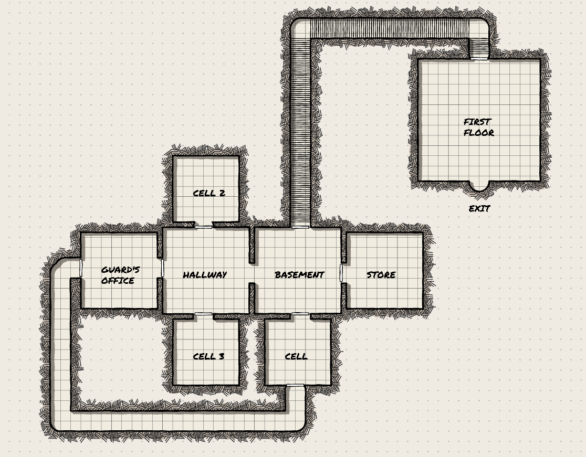

# Zork

## Description
This is a Zork game where you must escape a prison.

## Authors
- Andreu Castaño Jimenez

## Repository Link
The source code for the game is available on GitHub. You can access the repository here:
[Zork - GitHub Repository](https://github.com/andreucastano01/Zork)

## License
This project is licensed under the MIT License. For more details, see the [LICENSE](LICENSE) file.

## Game Guide

### How to Play
1. **Starting the Game**: Run the 'Zork.exe' file.
2. **Game Commands**:
  - 'north': Move the player to the north.
	- 'east': Move the player to the east.
	- 'west': Move the player to the west.
	- 'south': Move the player to the south.
	- 'move direction': Move the player to a direction.
	- 'take/get/grab/pick item': Grab an item and put it on your inventory.
	- 'inventory': See the inventory.
	- 'look/description': Briefly explain the room.
	- 'talk person': Talk with a person.
	- 'equip item': Equip an item.
	- 'exit': Exit the game.
	- 'help': For showing this help message.

### How to Complete the Game
1. **Main Objective**: The main objective is to escape the prison.
2. **Steps to Complete the Game**:
    1. Take the lantern to see anything.
    2. Talk with the NPC (cellmate) and help him with the new command (scratch).
    3. Take the keys from the guard's office.
    4. Return to the cell (You can't open the door in the east).
    5. Try to get a sword.
    6. Equip it.
    7. Go to the first floor and defeat the guard.

### Map

### Extra Information

I don't have an unique feature, as I added a key to the cell door (and a door that can't be opened), an npc that give you a mission (scratch her back) that unlocks a new passage and an autocombat.
The thing I struggled the most was doing the npc dialog. My first idea was having 2-3 options in the dialog, but for lack of time I just do it a simple dialog where it unlocks a new command and a new path if It completes the mission. Also doing the mission, gives the npc a new dialog thanking you.
